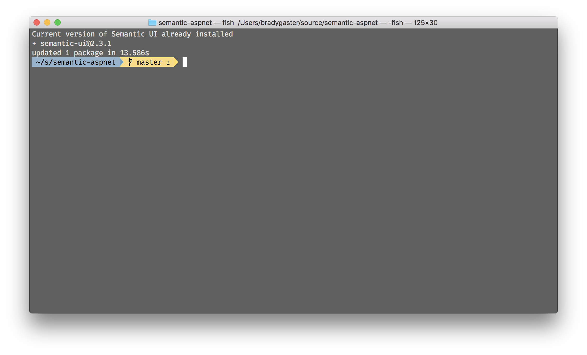

# Using Semantic UI with ASP.NET Core Razor Pages

This repository accompanies the blog post [Using Semantic UI with ASP.NET Core Razor Pages](http://www.bradygaster.com/posts/semantic-ui-aspnetcore-razor). 

## Usage

Clone it.

```
git clone https://github.com/bradygmsft/semantic-ui-aspnetcore-razor.git
```

Install [Semantic UI](http://semantic-ui.com) into it.

```
npm install semantic-ui --save
```



Build it. 

```
cd semantic
gulp build
```


Run it.

```
cd ..
dotnet run
```


## Deployment Note

Once you start customizing your theme, make sure to edit the `.gitignore` file such that you're pushing up the Semantic UI files. 

```
# you'll want to remove these once you start customizing your theme or you want to publish it
semantic
wwwroot/semantic
```

Enjoy! Happy coding!